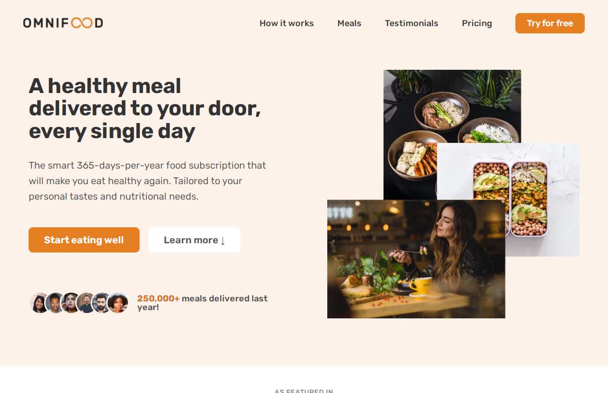

# Omnifood

## The omnifood amazing website project built with HTML and CSS and java-script

The project is made using Flex-box and grid layout in addition to soma javascript code and it contain: 

- Hero section 
- featured in section 
- how it works section 
- meals section 
- testimonials section
- pricing section 
- call to action section 
- footer 

## [live demo](https://abdelrhman-ahmed-kamal.github.io/omnifood/)

